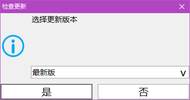
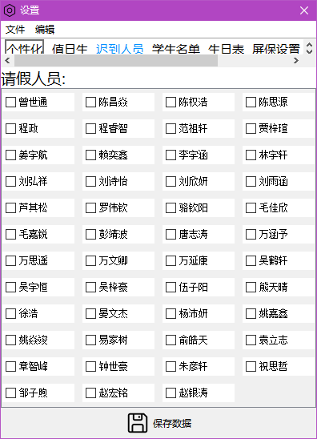
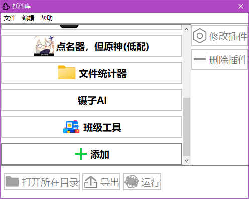
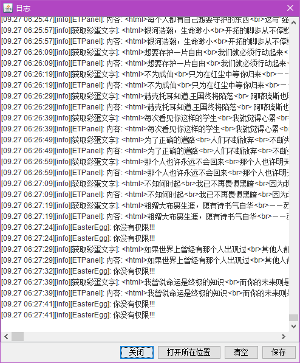
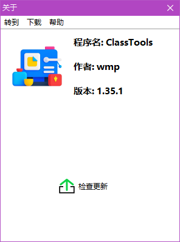
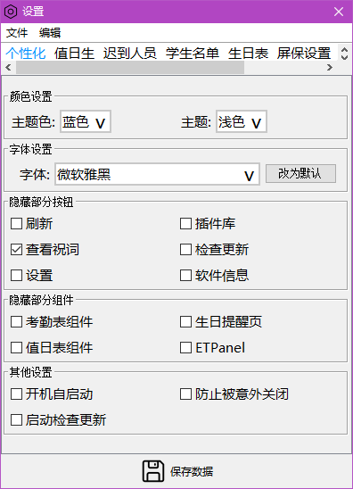

# 帮助文档(更新至1.37.0)

# 界面

## 时间显示页 (时间显示)

放大按钮""用于全屏显示时间

## 值日表 (显示值日情况)

按""，""
切换值日表

## 值勤表(显示实到人员，请假人员)

在人数显示下面，若有人请假，则会显示在下面

## 倒计时(查看距离特定时间还差多久)

显示差多久,结束时提醒

## 生日提醒(提醒是否有人即将过生日/正在生日)

1. 按"今日过生日"，若存在正在过生日的人，则会显示在下方名称显示栏

2. 按"即将过生日"，若存在10天内会过生日的人，将会显示在下方的名称显示栏

3. 按"今日过生日"，若存在正在过生日的人，则会全屏显示

4. 按"即将过生日"，若存在10天内会过生日的人，则会全屏显示

## 彩蛋文字显示页（显示彩蛋文字）

每过一段时间，就会刷新文字

## 按钮组（显示功能按键）

显示功能按键，按下后打开对应页面

隐藏的按钮可以点击""显示

### 相关按钮（部分弹出的窗口功能详情在后面）

#### ：显示祝词，在特殊日子时可以让祝福词多次显示，没有便不显示

#### ：检查更新，在选择更新的版本后若存在对应的新版本，便会确认更新

#### ：设置，用于设置数据

> 
> 
> 选择要设置的页面设置完后点击保存，再换页

#### ：刷新，若程序出现问题/数据没有被刷新，可以按下后刷新

#### ：插件库，用于快速启动，并且下载官方插件

#### ：查看日志，显示班级工具的日志，可以在程序出错时，查看错误原因

> 

#### ：软件信息，显示软件信息

可以快速跳转部分位置，下载新版本、源代码，查看本地帮助

#### ：关闭键，若选中了"个性化（设置）"->"防止意外关闭"，则不会显示

# 其他弹窗

## 设置

要设置哪些数据，就在哪页设置，设置完要先按"保存"，再换页

### 个性化

可以设置颜色，字体，想折叠起来的按钮，想隐藏的界面以及一些杂项

### 屏保设置

设置屏保状态下的背景，背景刷新间隔，颜色

### 软件数据管理

管理班级工具的相关文件

### 其他设置页（无）

## 插件

用于快速启动程序，文件

可以将打包的插件文件（.zip）拖拽到此处添加，或者在"文件"栏->
导入插件

更多功能自行探索
